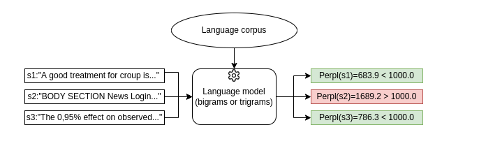

# Pyplexity

This package provides a simple interface to apply perplexity filters to any document. A possible use case for this technology could be the removal of boilerplate. 
Furthermore, it provides a WARC and HTML bulk processor, with distributed capabilities.



## Models
Memory intensive but does not scale on CPU. 
| Model | RAM usage | Download size | Performance |
| --- | --- | --- | --- | 
| bigrams-cord19 | 2GB | 230MB | x |
| bigrams-bnc | 5GB | 660MB | x |
| trigrams-cord19 | 6,6GB | 1GB | x |
| trigrams-bnc | 14GB | 2,2GB | x |

## Installation process
```
python3 -m pip install pyplexity
```
## Usage example

### Compute perplexity from console
Command "perplexity". By default, bigrams-bnc. Argument "--model bigrams-bnc" changes model. 
Documentation:
```
citius@pc:~$ pyplexity perplexity --help
Usage: pyplexity perplexity [OPTIONS] TEXT

Arguments:
  TEXT  [required]

Options:
  --model TEXT  [default: bigrams-bnc]
  --help        Show this message and exit.
```
By default, models are stored in ~/.cache/cached_path/, as per cached-path package documentation. Example:
```
citius@pc:~$ pyplexity perplexity "this is normal text"
downloading: 100%|##########| 660M/660M [00:11<00:00, 59.0MiB/s]
Loading model... Done.
1844.85540669094
citius@pc:~$ pyplexity perplexity "this is normal HTML PAGE BOI%& 678346 NOR  text"
Loading model... Done.
44787.99199563819
```
### Bulk perplexity computation and cleaning of a directory
Documentation:
```
citius@pc:~$ pyplexity bulk-perplexity --help
Usage: pyplexity bulk-perplexity [OPTIONS] INPUT_DIR

Arguments:
  INPUT_DIR  [required]

Options:
  --output-dir TEXT                [default: out_dir]
  --model TEXT                     [default: bigrams-bnc]
  --perpl-limit FLOAT              [default: 8000.0]
  --warc-input / --no-warc-input   [default: no-warc-input]
Distributed computing options:
  --distributed / --no-distributed [default: no-distributed]
  --n-workers INTEGER              [default: 1]
  --node INTEGER                   [default: 1]
  --port INTEGER                   [default: 8866]
  --help                           Show this message and exit.
```
We will explain the distributed computing capabilities later. Input directory is allowed to have recursive subdirectories with files. It can process both WARC and raw text files. WARC containers and HTML files should have been previously tag-cleaned with the command below. Example:
```
citius@pc:~$ pyplexity bulk-perplexity ./out_dir/ --output-dir cleaned_files --model bigrams-cord19
downloading: 100%|##########| 233M/233M [00:03<00:00, 63.3MiB/s] 
Loading model... Done.
Computed 1124 files in 0:00:01.905390.
```

### Perform HTML tag cleaning of a directory
Documentation:
```
citius@pc:~$ pyplexity tag-remover --help
Usage: pyplexity tag-remover [OPTIONS] BASE_DIR

Arguments:
  BASE_DIR  [required]

Options:
  --output-dir TEXT                [default: out_dir]
  --warc-input / --no-warc-input   [default: no-warc-input]
Distributed computing options:
  --distributed / --no-distributed [default: no-distributed]
  --n-workers INTEGER              [default: 1]
  --node INTEGER                   [default: 1]
  --port INTEGER                   [default: 8866]
  --help                           Show this message and exit.

```
We will explain the distributed computing capabilities later. Input directory is allowed to have recursive subdirectories with files. It can process HTML files or WARC files. In this case, it will recompress the WARC efficiently, after stripping out all the tags. Example:
```
citius@pc:~$ pyplexity tag-remover ./html_source --output-dir ./output
Computed 1124 files in 0:00:00.543175.
```
## Distributed mode (cluster)

## Interfacing from Python


## Building the package

```
git clone https://github.com/citiususc/pyplexity && cd pyplexity
curl -sSL https://raw.githubusercontent.com/python-poetry/poetry/master/get-poetry.py | python3 -
source $HOME/.poetry/env
poetry build
pip3 install dist/pyplexity-X.X.X-py3-none-any.whl
```
